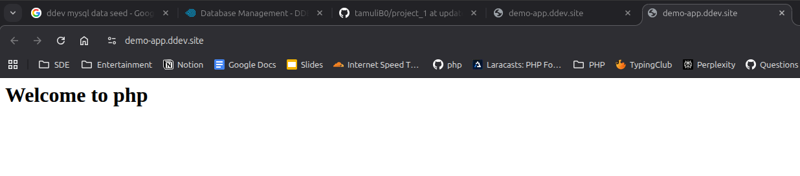

 ## How to setup the project:
1. Ensure that ddev is installed on your system before proceeding.
2. Always run all ddev commands in your repository root folder.
3. Run below command for setting up ddev configurations for this project -
    ```sh
     ddev config
     ```
     Note: The above command will ask for a project name, you can choose any name and then follow along the prompts and **remember to select the project type as `PHP`**.
5. Run below command to start the web-server, database and php containers.
    ```sh
     ddev start
     ```
6. Finally run below command to start your application.
    ```sh
     ddev launch
     ```
7. The output from the above command should look like -
    ```sh
    $ ddev launch

    Project demo-app is not running, starting it
    Starting demo-app... 
    Building project images....
    Project images built in 2s. 
    Network ddev-demo-app_default  Created 
    Container ddev-demo-app-web  Created 
    Container ddev-demo-app-db  Created 
    Container ddev-demo-app-db  Started 
    Container ddev-demo-app-web  Started 
    Waiting for containers to become ready: [web db] 
    Starting ddev-router if necessary... 
    Container ddev-router  Created 
    Container ddev-router  Started 
    Successfully started demo-app 
    Your project can be reached at https://demo-app.ddev.site
    See 'ddev describe' for alternate URLs. 
    Opening in existing browser session.
    ```
8. You can check the app on your browser -


